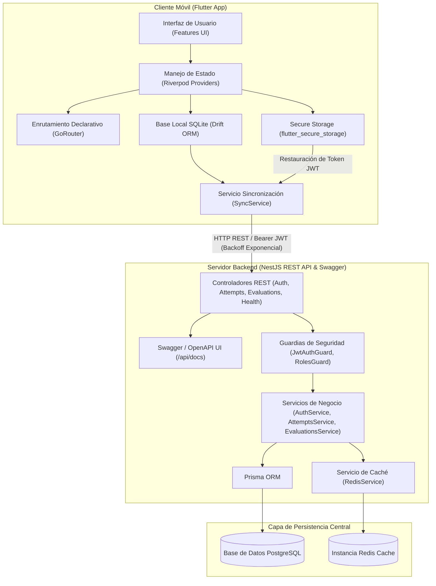
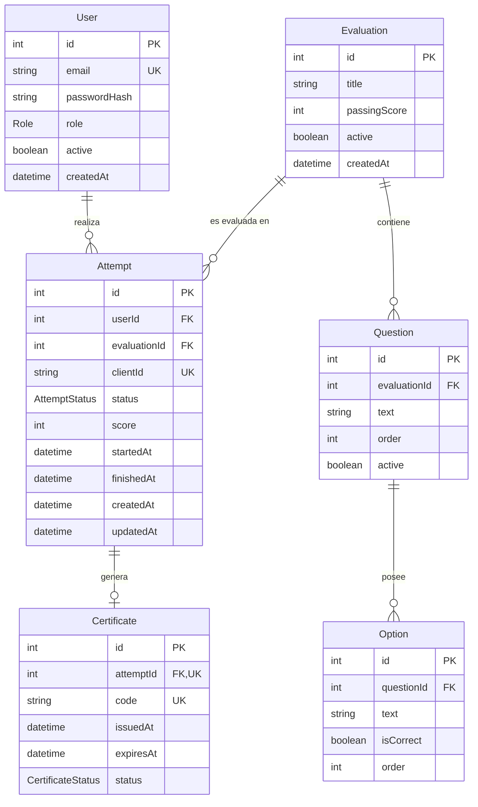

# Documento Maestro Fuente para el Informe Técnico Final: SafeAccess 90

---

## 1. Datos Generales

* **Institución Académica:** Universidad Estatal Amazónica (UEA)
* **Carrera:** Ingeniería en Tecnologías de la Información
* **Asignatura:** Aplicaciones Móviles
* **Proyecto Final:** SafeAccess 90 — Sistema Móvil de Inducción, Evaluación y Certificación en Seguridad Ocupacional
* **Integrantes del Equipo:**
  * Daniel Hidalgo
  * Juliana Jumbo
* **Docente Guía:** Ing. Julio Hurtado MSc.
* **Periodo Lectivo:** Semestre 5
* **Repositorio de Código:** [GitHub - seeker-devil/flutter_App_Movil (Rama: develop)](https://github.com/seeker-devil/flutter_App_Movil/tree/develop)

---

## 2. Introducción

En entornos industriales y empresariales, la inducción en Seguridad y Salud Ocupacional es un requisito legal y operativo indispensable para mitigar riesgos laborales. No obstante, los procesos tradicionales de capacitación presencial suelen presentar dificultades de cobertura, registros manuales propensos a pérdidas y falta de disponibilidad en zonas operativas remotas sin conexión a red.

El presente proyecto documenta el desarrollo de **SafeAccess 90**, una solución informática multiplataforma compuesta por una aplicación móvil desarrollada en Flutter y una API REST desacoplada construida sobre NestJS. La solución aborda los desafíos del entorno industrial mediante una arquitectura Offline-First, garantizando que el personal pueda capacitarse, presentar evaluaciones y generar certificados digitales de aprobación de forma ininterrumpida, independientemente de la estabilidad de la red.

---

## 3. Descripción del Proyecto

**SafeAccess 90** es un sistema integral de inducción, evaluación y certificación en Seguridad y Salud en el Trabajo.

* **Problema que Atiende:** Falta de mecanismos automatizados, seguros y con soporte sin conexión para capacitar y verificar los conocimientos del personal en normativa de seguridad antes de su ingreso a instalaciones de riesgo.
* **Propósito:** Automatizar la entrega del material educativo inductivo, la toma de evaluaciones de opción múltiple, el registro seguro de intentos de evaluación, la administración completa de evaluaciones y la emisión verificable de certificados digitales de aprobación.
* **Flujo Principal del Usuario:**
  1. Autenticación del usuario participante con correo electrónico y contraseña.
  2. Consulta del material inductivo y módulos temáticos de seguridad en la pantalla principal.
  3. Ejecución del cuestionario interactivo de evaluación (quiz).
  4. Registro automático del intento en la base de datos local SQLite y transmisión sincrónica o asincrónica al backend NestJS.
  5. Emisión del certificado digital de aprobación con código alfanumérico único para puntuaciones $\ge 70\%$.
* **Tipos de Usuario:** `PARTICIPANT` (Trabajador) y `ADMIN` (Administrador de Seguridad).
* **Operatividad Online/Offline:** Permite el uso completo de la inducción y la evaluación sin cobertura de red. Los intentos completados offline se encolan con identificadores únicos UUID v4 (`clientId`) y se sincronizan automáticamente en segundo plano al restablecer la conectividad.

---

## 4. Objetivos

### Objetivo General
Desarrollar una aplicación móvil multiplataforma integrada a un servidor backend REST API para la inducción, evaluación y certificación en Seguridad y Salud Ocupacional, aplicando principios de arquitectura limpia, gestión de estado reactiva y persistencia Offline-First.

### Objetivos Específicos
1. Diseñar e implementar un backend desacoplado con NestJS, Prisma ORM y PostgreSQL normalizado en 3FN con autenticación JWT, roles y documentación Swagger / OpenAPI.
2. Construir la gestión CRUD administrativa completa para evaluaciones (`EvaluationsModule`) con soporte de baja lógica (`active = false`) e integridad de datos histórica.
3. Desarrollar la aplicación móvil en Flutter estructurada por características (`features/`), utilizando Riverpod para el manejo de estado y GoRouter para la navegación reactiva.
4. Implementar un mecanismo de persistencia local relacional en el dispositivo utilizando Drift SQLite y almacenamiento seguro cifrado con `flutter_secure_storage`.
5. Diseñar un servicio de sincronización en segundo plano con algoritmo de Backoff Exponencial y control de idempotencia para la resolución de conflictos Offline-First.
6. Construir un Sistema de Diseño atómico reutilizable con tokens estandarizados de color, tipografía, espaciado y componentes accesibles.
7. Validar la calidad del código mediante la ejecución de 29 pruebas automáticas en Flutter y 24 pruebas unitarias Jest en NestJS.

---

## 5. Requerimientos

### Requerimientos Funcionales (RF)
* **RF-01 (Autenticación):** El sistema debe autenticar usuarios mediante credenciales en el endpoint `POST /api/auth/login`.
* **RF-02 (Sesión Persistente Cifrada):** Guardar el token JWT en `flutter_secure_storage` y restaurar la sesión automáticamente al iniciar la app.
* **RF-03 (Capacitación Inductiva):** Presentar módulos educativos de seguridad en la pantalla de inicio (`/`).
* **RF-04 (Evaluación de Conocimientos):** Desplegar un quiz de opción múltiple, procesar respuestas y calcular la nota porcentual final.
* **RF-05 (Certificado Digital):** Emitir un certificado con código único alfanumérico si la nota es $\ge 70\%$.
* **RF-06 (Persistencia Local Offline):** Guardar intentos localmente en SQLite mediante Drift con estado `PENDING_CREATE` cuando no haya red.
* **RF-07 (Sincronización Inteligente):** Procesar la cola de sincronización pendiente aplicando Backoff Exponencial e idempotencia por `clientId`.
* **RF-08 (Cierre de Sesión Seguro):** Eliminar tokens de Secure Storage y vaciar las tablas locales de Drift al cerrar sesión (`logout`).
* **RF-09 (Control de Roles y CRUD Administrativo):** Restringir rutas administrativas en backend (`/api/auth/admin-check`, `POST /api/evaluations`, `PATCH /api/evaluations/:id`, `DELETE /api/evaluations/:id`) al rol `ADMIN` mediante `RolesGuard`.

### Requerimientos No Funcionales (RNF)
* **RNF-01 (Seguridad):** Hash de contraseñas con Bcrypt (Factor 10) y tokens cifrados en Android Keystore / iOS Keychain.
* **RNF-02 (Operatividad Offline-First):** Disponibilidad completa del flujo de capacitación y evaluación sin acceso a internet.
* **RNF-03 (Idempotencia e Integridad):** Garantía de no duplicación de intentos en el servidor usando restricciones `@unique` sobre `clientId`.
* **RNF-04 (Rendimiento):** Integración de Redis (`ioredis`) para mitigar latencia en consultas repetitivas.
* **RNF-05 (Diseño Atómico):** Estandarización visual con tokens de color, espaciado, tipografía y componentes UI modulares.
* **RNF-06 (Calidad de Código):** Cobertura con 29 pruebas Flutter y 24 pruebas Jest pasadas al 100%, con 0 errores en `flutter analyze` y ESLint.

---

## 6. Arquitectura de la Solución

La arquitectura de **SafeAccess 90** sigue el patrón cliente-servidor distribuido con soporte de almacenamiento local diferencial (Offline-First).

### Diagrama de Arquitectura de la Solución (Mermaid)

---

## 7. Tecnologías Utilizadas

| Tecnología | Versión Verificada | Uso dentro del Proyecto SafeAccess 90 |
| --- | --- | --- |
| **Flutter** | 3.2x / SDK `>=3.2.0 <4.0.0` | Framework cliente multiplataforma (Android, iOS, Web, Desktop). |
| **Dart** | 3.2x | Lenguaje de programación fuertemente tipado para el cliente móvil. |
| **flutter_riverpod** | 2.5.1 | Gestión de estado reactivo y desacoplamiento de lógica de negocio. |
| **go_router** | 13.2.0 | Sistema de navegación y enrutamiento declarativo con guardias de auth. |
| **drift** / **drift_flutter** | 2.20.2 / 0.2.0 | ORM reactivo para la base de datos local SQLite. |
| **sqlite3_flutter_libs** | 0.5.24 | Librerías de motor C de SQLite3 para plataformas móviles y de escritorio. |
| **flutter_secure_storage** | 9.2.2 | Almacenamiento seguro cifrado (Android KeyStore / iOS KeyChain). |
| **connectivity_plus** | 6.0.5 | Detección reactiva de cambios en el estado de conectividad a red. |
| **uuid** | 4.5.1 | Generación de identificadores universales únicos v4 para idempotencia. |
| **NestJS** | 10.0.0 | Framework progresivo en Node.js/TypeScript para la API REST backend. |
| **@nestjs/swagger** / **swagger-ui-express** | 7.4.2 / 5.0.1 | Generación e interfaz web interactiva OpenAPI 3.0 (`/api/docs`). |
| **TypeScript** | 5.1.3 | Lenguaje base para el desarrollo del backend. |
| **Prisma ORM** | 5.0.0 | ORM tipo-seguro para el modelado y migraciones de PostgreSQL. |
| **PostgreSQL** | 15 (Alpine) | Motor de base de datos relacional del backend central. |
| **Redis** / **ioredis** | 7 (Alpine) / 5.3.2 | Caché en memoria para aceleración de lecturas y gestión de sesiones. |
| **Bcrypt** | 5.1.0 | Hashing de contraseñas de usuarios con factor de salado. |
| **Passport JWT** | 0.6.0 / 4.0.1 | Autenticación y firma/verificación de tokens JWT. |
| **Docker Compose** | 2.x | Orquestación de contenedores para PostgreSQL y Redis. |

---

## 8. Diseño de Base de Datos

### Base de Datos PostgreSQL (Backend Prisma)
El esquema central está normalizado en **Tercera Forma Normal (3FN)**, garantizando la integridad de datos.

---

## 9. Backend

El backend se construyó con NestJS siguiendo una arquitectura modular basada en inyección de dependencias.

* **`AppModule`:** Módulo raíz que importa `AuthModule`, `AttemptsModule`, `EvaluationsModule`, `HealthModule`, `PrismaModule` y `RedisModule`.
* **Manejo de Errores y Validaciones:** Los DTOs (`LoginDto`, `CreateAttemptDto`, `CreateEvaluationDto`, `UpdateEvaluationDto`) utilizan `class-validator` y `class-transformer` para validar la estructura de los payloads HTTP.
* **Documentación OpenAPI:** Integración de Swagger UI expuesto en `http://localhost:3000/api/docs`.

---

## 10. APIs y Endpoints

* **Swagger UI:** `http://localhost:3000/api/docs`

| Método | Ruta | Descripción | Autenticación | Payload Request | Respuesta Exitosa (200/201 OK) |
| --- | --- | --- | --- | --- | --- |
| `GET` | `/api/health` | Verificación de estado del servidor | Pública | N/A | `{"success": true, "message": "SafeAccess 90 backend is running", "timestamp": "..."}` |
| `POST` | `/api/auth/login` | Autenticación de usuario | Pública | `{"email": "...", "password": "..."}` | `{"success": true, "data": {"accessToken": "...", "tokenType": "Bearer", "user": {...}}}` |
| `GET` | `/api/auth/me` | Perfil del usuario autenticado | JWT Bearer | N/A | `{"success": true, "data": {"id": 1, "role": "PARTICIPANT", "active": true}}` |
| `GET` | `/api/auth/admin-check` | Verificación de rol Administrador | JWT + Role ADMIN | N/A | `{"success": true, "message": "Acceso administrativo autorizado"}` |
| `GET` | `/api/attempts` | Historial de intentos del usuario | JWT Bearer | N/A | `{"success": true, "data": [{...}]}` |
| `POST` | `/api/attempts` | Crear intento (idempotente por `clientId`) | JWT Bearer | `{"clientId": "...", "evaluationId": 1, "score": 100}` | `{"success": true, "message": "Intento registrado exitosamente", "data": {...}}` |
| `POST` | `/api/evaluations` | Crear nueva evaluación (CRUD) | JWT + Role ADMIN | `{"title": "...", "passingScore": 80}` | `{"success": true, "message": "Evaluación creada exitosamente", "data": {...}}` |
| `GET` | `/api/evaluations` | Listar evaluaciones (CRUD) | JWT Bearer | N/A | `{"success": true, "data": [{...}]}` |
| `GET` | `/api/evaluations/:id` | Obtener evaluación por ID (CRUD) | JWT Bearer | Param: `:id` | `{"success": true, "data": {...}}` |
| `PATCH` | `/api/evaluations/:id` | Editar evaluación por ID (CRUD) | JWT + Role ADMIN | Param: `:id` Body: `{"passingScore": 85}` | `{"success": true, "message": "Evaluación actualizada exitosamente", "data": {...}}` |
| `DELETE` | `/api/evaluations/:id` | Desactivar evaluación (Baja lógica) | JWT + Role ADMIN | Param: `:id` | `{"success": true, "message": "Evaluación desactivada exitosamente (Baja lógica)", "data": {...}}` |

---

## 11. Autenticación y Seguridad

* **Hash de Contraseñas:** Las contraseñas se almacenan en PostgreSQL procesadas con `bcrypt` (factor de salado 10).
* **Tokens JWT:** Al autenticarse correctamente, el servidor firma un token JWT especificando el usuario (`sub`) y rol (`role`).
* **Guardias NestJS:** `JwtAuthGuard` valida el header Bearer JWT. `RolesGuard` valida permisos privilegiados `@Roles('ADMIN')`.
* **Seguridad en Dispositivo Móvil:** Almacenamiento seguro en `flutter_secure_storage` con limpiado total en `logout()`.

---

## 12. Aplicación Flutter

El cliente móvil está organizado en carpetas por característica (`features/`): `auth`, `training`, `quiz` y `certificate`.

---

## 13. Diseño de Interfaz y Accesibilidad

Sistema de Diseño Atómico en `lib/design_system/`: Tokens (`AppColors`, `AppTypography`, `AppSpacing`, `AppRadius`) y componentes reutilizables (`SafeAccessButton`, `SafeAccessStatusCard`, `SafeAccessAsyncState`, `SafeAccessSectionCard`).

---

## 14. Integración Móvil-Backend

Peticiones HTTP REST asíncronas con token Bearer JWT e inyección de clientes síncronos/asíncronos.

---

## 15. Persistencia Local y Funcionamiento Offline

Arquitectura Offline-First con Drift SQLite, cola `PendingOperationsTable`, algoritmo de Backoff Exponencial e idempotencia UUID v4 (`clientId`).

---

## 16. Métodos de Optimización

Redis cache en memoria, índices `@unique` en PostgreSQL, idempotencia HTTP, Streams reactivos en Drift SQLite y Backoff Exponencial.

---

## 17. Pruebas Funcionales e Integración

### Suite de Pruebas Móvil (Flutter)
* **Comando:** `flutter test` $\rightarrow$ **29 de 29 pruebas pasadas (100%)**. `flutter analyze` $\rightarrow$ **0 issues**.

### Suite de Pruebas Backend (NestJS)
* **Comando:** `npm run test` (Jest) $\rightarrow$ **24 de 24 pruebas unitarias pasadas en 5 suites (100%)**.
* **Calidad y Build:** `npm run lint` $\rightarrow$ **0 errores**. `npm run build` $\rightarrow$ **Éxito**.

---

## 18. Evidencias de Funcionamiento

Planificadas detalladamente en [FINAL_SCREENSHOT_PLAN.md](file:///C:/Users/alejo/Desktop/work%20sin%20BACKUP/github/sem5/appmov/flutter/training_quiz_app/docs/FINAL_SCREENSHOT_PLAN.md).

---

## 19. Evolución del Proyecto

Reconstruida en [PROJECT_EVOLUTION.md](file:///C:/Users/alejo/Desktop/work%20sin%20BACKUP/github/sem5/appmov/flutter/training_quiz_app/docs/PROJECT_EVOLUTION.md).

---

## 20. Conclusiones

1. Se desarrolló una solución informática completa, escalable y segura, cumpliendo con los estándares de desarrollo profesional exigidos por la Universidad Estatal Amazónica.
2. Las operaciones CRUD y la documentación de API Swagger / OpenAPI en `/api/docs` garantizan un backend mantenible e interoperable.
3. La suite de pruebas automáticas (29 pruebas en Flutter y 24 en NestJS) garantiza estabilidad sin regresiones.

---

## 21. Repositorio

* **URL del Repositorio:** [https://github.com/seeker-devil/flutter_App_Movil/tree/develop](https://github.com/seeker-devil/flutter_App_Movil/tree/develop)
* **Rama Principal:** `develop`

---

## 22. Video Final

* **Estado:** Pendiente de grabación siguiendo [VIDEO_ENVIRONMENT_GUIDE.md](file:///C:/Users/alejo/Desktop/work%20sin%20BACKUP/github/sem5/appmov/flutter/training_quiz_app/docs/VIDEO_ENVIRONMENT_GUIDE.md).
